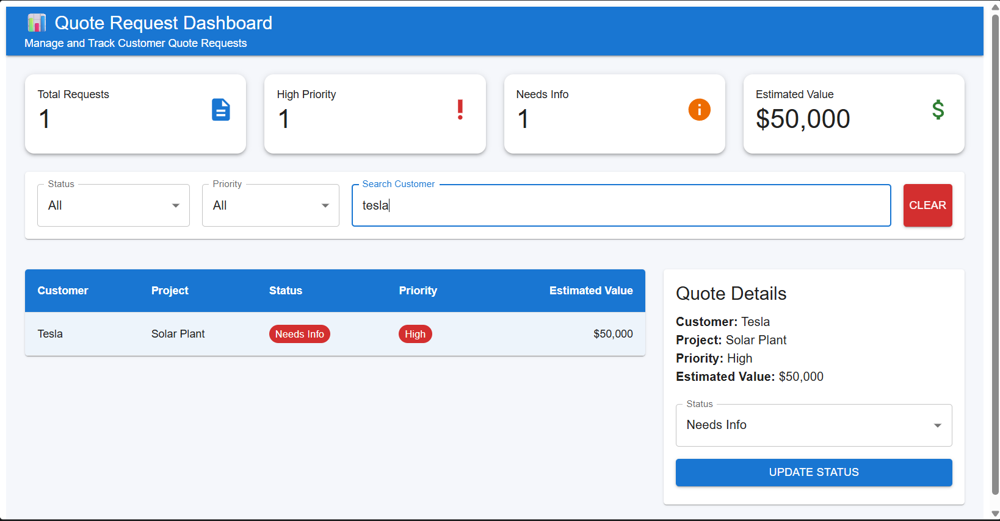

# 📊 Quote Request Dashboard

A modern Quote Request Dashboard built using **React, Redux Toolkit, TanStack Query, Material UI, Axios, and FastAPI**.

The application allows users to:

- 📋 View customer quote requests
- 🔍 Search quotes by customer or project
- 🎯 Filter by Status and Priority
- 📄 View detailed quote information
- ✏️ Update quote status in real time
- ⚡ Automatically refresh data using TanStack Query

---

## 📸 Dashboard Preview




---

## ✨ Features

- Dashboard Summary Cards
- Search Functionality
- Status & Priority Filters
- Quote Details Panel
- Status Update
- Responsive Layout
- Material UI Components
- FastAPI REST API
- React Query Caching & Auto Refetch
- Redux Toolkit State Management


---


## 🛠 Tech Stack

### Frontend

- React 19
- Vite
- Material UI
- Redux Toolkit
- TanStack Query
- Axios

### Backend

- FastAPI
- Python
- Uvicorn

---

## 📂 Project Structure

```
QuoteDashboard/

├── backend/
│   ├── main.py
│   ├── quotes.json
│   └── requirements.txt
│
├── frontend/
│   ├── src/
│   │
│   ├── api/
│   ├── app/
│   ├── components/
│   ├── features/
│   ├── hooks/
│   ├── pages/
│   │
│   ├── App.jsx
│   └── main.jsx
│
└── README.md
```

---

## ⚙ Installation

### Backend

```bash
cd backend

python -m venv venv

venv\Scripts\activate

pip install -r requirements.txt

uvicorn main:app --reload
```

Backend runs on

```
http://127.0.0.1:8000
```

---

### Frontend

```bash
cd frontend

npm install

npm run dev
```

Frontend runs on

```
http://localhost:5173
```

---

## API Endpoints

### Get Quotes

```
GET /quote-requests
```

### Update Status

```
POST /quote-requests/{id}/status
```

---

## Future Improvements

- Authentication
- Pagination
- Sorting
- Export to Excel/PDF
- Charts & Analytics
- Database Integration
- Role-Based Access Control

---

## Author

**Pratik Bapusaheb Khandve**

Artificial Intelligence & Data Science Student

Ajeenkya DY Patil School of Engineering
